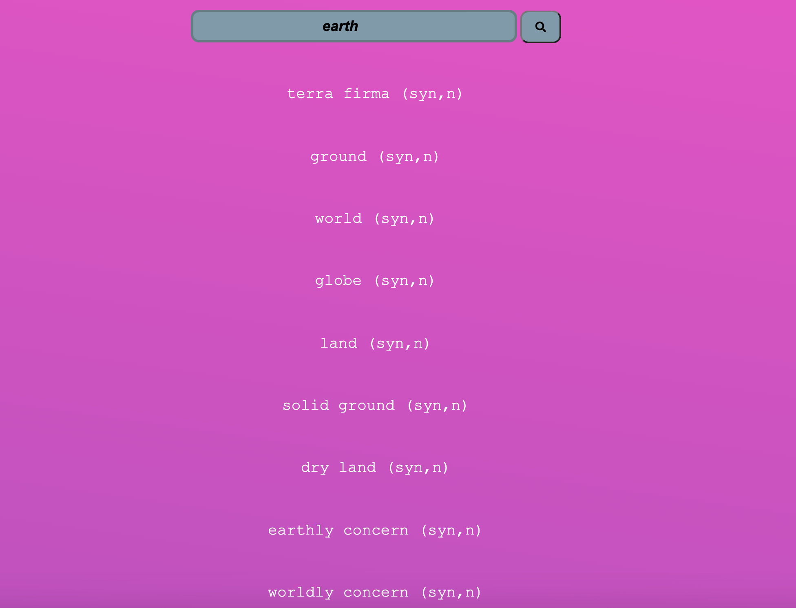
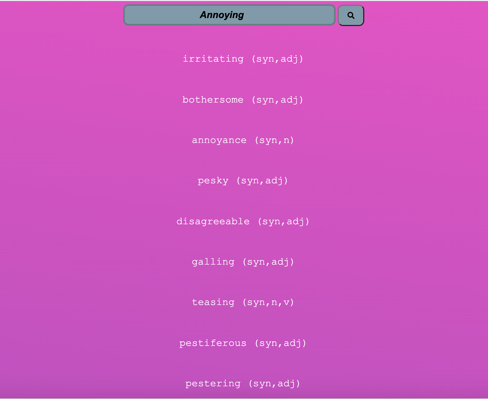

<!-- PROJECT LOGO -->
 

  

  <h3 align="center"> Searching for Similar Words Meaning </h3>
  

    <a href="https://searchbox123.herokuapp.com/"><strong>Check our application »</strong></a>
  

<!-- TABLE OF CONTENTS -->

## Table of Contents

- [About the Project](#about-the-project)
- [Built With](#built-with)
- [Getting Started](#getting-started)
- [Roadmap](#roadmap)
- [Contact](#contact)

<!-- ABOUT THE PROJECT -->

## About The Project

  
  

 Find almost all the words with similar meaning
                   to your given word via autocomplete search_box.

 for every given word; 
  
  provides all the words with similar meaning to help you figure out the meaning of a new word you face. 

Available soon!!!!!
A communication app that helps understanding the meaning of given word.

## Built With

- HTML
- CSS
- JS

<!-- GETTING STARTED -->

## Getting Started

Check out the project instructions from WebAhead: [Projet instructions](https://github.com/WebAhead/master-reference/blob/master/coursebook/week-6/project.md)

<!-- ROADMAP -->

## Roadmap

See the [open issues](https://github.com/WebAhead7/SimilarWords/issues) for a list of proposed features (and known issues).

<!-- CONTACT -->

## Contact

- Mr. Rakad Khawaled: [@GitHub](https://github.com/rakad-kh)
